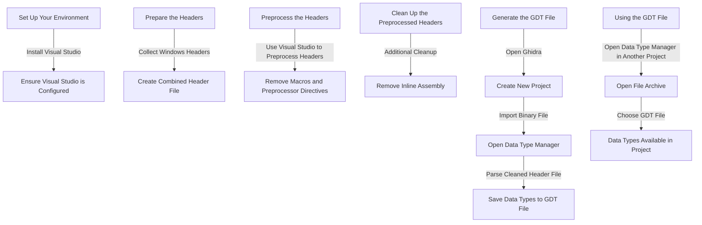

# Ghidra Data Types - Building a Custom Ghidra GDT from NDIS Windows DDK Headers

## About

This repository contains a Visual Studio template project for building an NDIS filter driver. The project isn't meant to show you how to build a driver, but rather demonstrate how Visual Studio can be used to create a custom preprocessed header that Ghidra can use to extract all the NDIS related data types. 

## Background

For background, check out the supporting blog posts.

- [Everyday Ghidra: Ghidra Data Types— When to Create Custom GDTs — Part 1](https://medium.com/@clearbluejar/everyday-ghidra-ghidra-data-types-when-to-create-custom-gdts-part-1-143fe45777eb)

The article discusses how to create custom data types in Ghidra, a software reverse engineering tool, using Windows header files. It explains the process of creating custom Ghidra Data Types (GDTs) from Windows headers, which can help in analyzing and understanding binary files more effectively. The article covers topics such as understanding the structure of Windows headers, parsing them to extract relevant information, and integrating the custom data types into Ghidra's analysis environment.

- [Everyday Ghidra: Ghidra Data Types - Creating Custom GDTs From Windows Headers - Part 2](https://medium.com/@clearbluejar/everyday-ghidra-ghidra-data-types-creating-custom-gdts-from-windows-headers-part-2-39b8121e1d82)

## Steps to Preprocess a Custom Header with Visual Studio 2022

1. Using the included project, open [ndis-headers.sln](ndis-headers/ndis-headers.sln) with Visual Studio 2022.
2. Right-click on the file [ndis-headers.c](ndis-headers/ndis-headers.c) and click *Compile*.
3. Take the resulting preprocessed file found at `ndis-headers\x64\Debug\ndis-headers.i` and included in the repo at [ndis-headers.i](gdts/headers/ndis-headers.i) and clean up the file using this [Cyberchef recipe]( https://gchq.github.io/CyberChef/#recipe=Find_/_Replace(%7B'option':'Regex','string':'%23pragma%5B%5E%5C%5Cn%5D%20%5C%5Cn'%7D,'',true,false,false,false)Find_/_Replace(%7B'option':'Regex','string':'(?:__forceinline%7C__inline)((?:%5B%5E%7B%5D*%5C%5Cn%5B%5E%7B%5D*))%5C%5C%7B(?:%5C%5C%7B%5B%5E%7B%7D%5D*%5C%5C%7D%7C%5B%5E%7B%7D%5D)*%5C%5C%7D'%7D,'$1;',true,false,true,false)Find_/_Replace(%7B'option':'Regex','string':'__declspec%5C%5C(%5B%5E%5C%5C)%5D%20%5C%5C)%20'%7D,'',true,false,true,false).
4. Save the result to `ndis-headers-clean.h` or use the example [ndis-headers-clean.h](gdts/headers/ndis-headers-clean.h)
5. Use this new header to create a new NDIS gdt file using Ghidra's C-Parser. Open the Codebrowser and click *File -> Parse C Source...*
6. Save the file to `ndis_64.gdt` or use the reference one here [ndis_64.gdt](gdts/ndis_64.gdt).

All of the steps and more are detailed in the blog posts linked above.

## Ready to Dive Deeper? 🌊

</div

If this example and the world of reverse engineering piqued your interest, why not take your skills to the next level with Clearseclab's comprehensive training courses? This in-depth example is just the tip of the iceberg. Our courses offer a treasure trove of knowledge to help you master reverse engineering and more. Join us at Clearseclabs LLC and unlock a world of possibilities! [Learn more about Clearseclab's training courses](https://www.clearseclabs.com/#portfolio).
